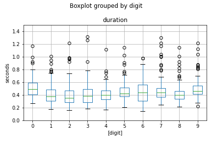
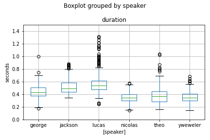
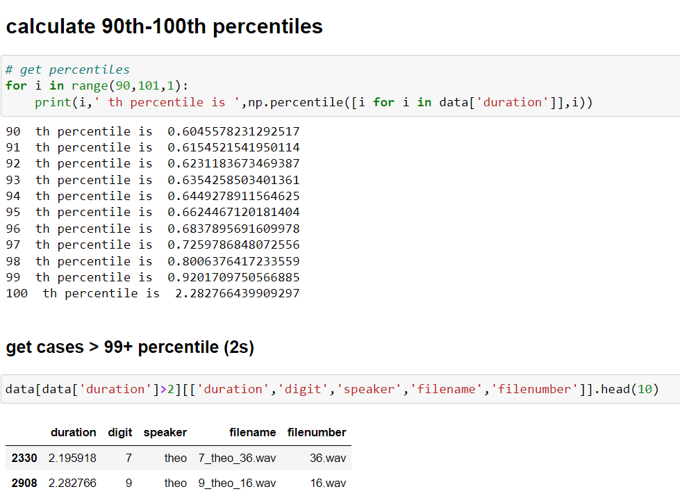

<!--
Audio MNIST data description and statistic analysis on durations
---
-->
We first download audio MNIST (digits) data from [here](https://www.kaggle.com/datasets/alanchn31/free-spoken-digits).  This is a balanced dataset in terms of labels/digits and speakers, with 6 male speakers and each person has 500 recordings for digits, 50 recordings per digits per person. Each digits have then 50 x 6 = 300 files.

Distribution of duration (in seconds) across labels (digits) and speakers 
---

Distribution of duration boxplot by digits (labels). Overall, the majority of audios for all digits duration is around 0.2-0.8 seconds. 

Distribution of duration boxplot by speakers. Audios from the last three speakers ('nicolas', 'theo' and 'yweweler') have similar durations and relatively shorter. 

Two outliers in this dataset with extra long duration:

